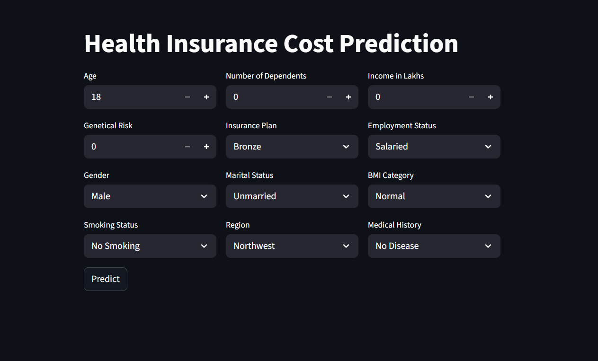
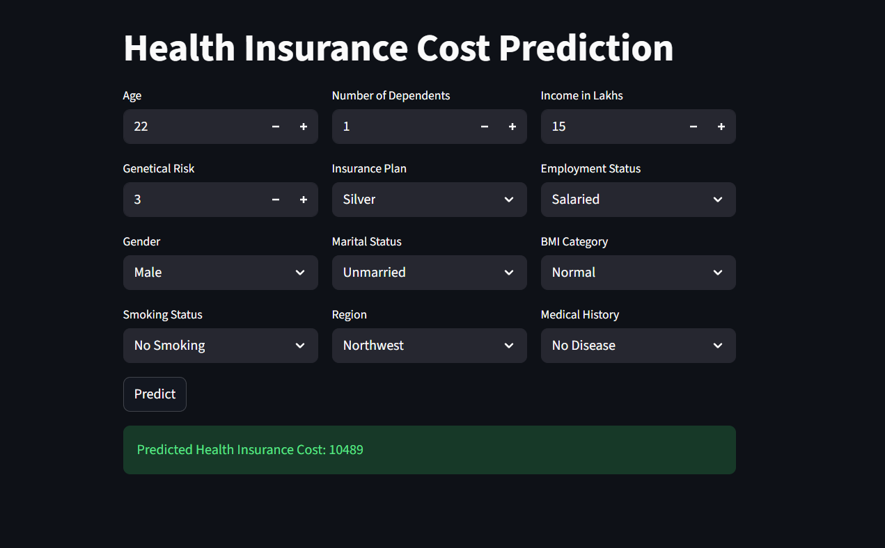
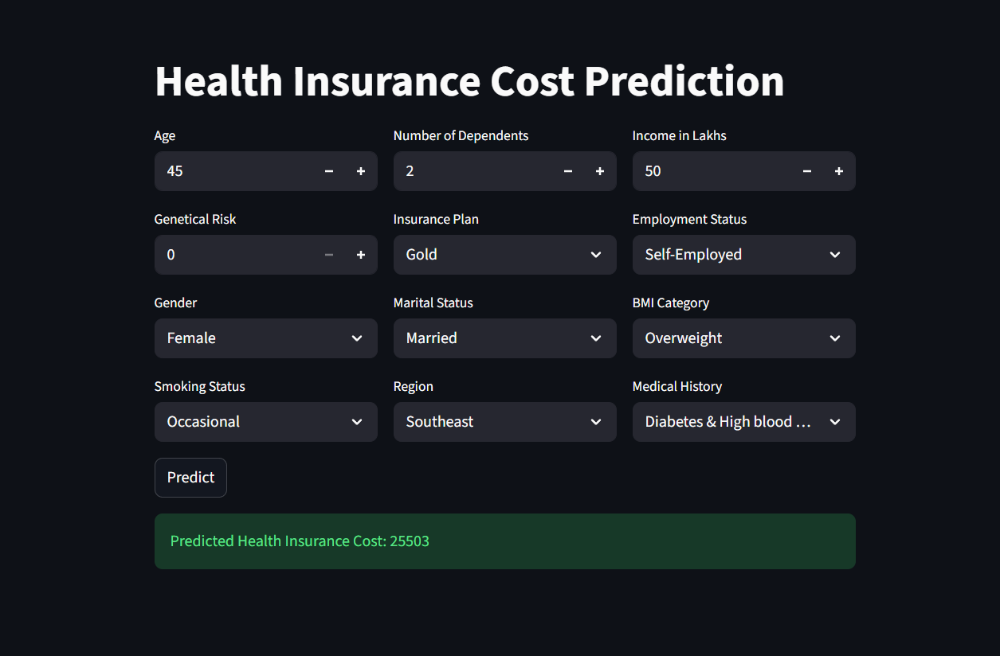

# Healthcare_Premium_Prediction_ML_Project

## 📌 Table of Contents
1. [Overview](#overview)
2. [Business Problem](#business-problem)
3. [Dataset](#dataset)
4. [Tools & Technologies](#tools--technologies)
5. [Project Structure](#project-structure)
6. [Data Cleaning & Preparation](#data-cleaning--preparation)
7. [Exploratory Data Analysis (EDA)](#exploratory-data-analysis-eda)
8. [Research Questions & Key Findings](#research-questions--key-findings)
9. [Model Development](#model-development)
10. [Web Application Dashboard](#web-application-dashboard)
11. [How to Run This Project](#how-to-run-this-project)
12. [Final Recommendations](#final-recommendations)
13. [Author & Contact](#author--contact)

---

## Overview

This project builds a **Machine Learning-based Health Insurance Premium Prediction System** using advanced data science techniques. The system segments customers into **two age groups** (Young ≤25 and Rest >25) and applies specialized models to predict annual insurance premiums with high accuracy.

### Key Achievements:
- 🎯 **Young Group Error Rate**: 2.14% (Improved from 73%!)
- 🎯 **REST Group Error Rate**: 0.3% (Excellent precision)
- 🎯 **Production Ready**: Both models deployed with Streamlit UI
- 🎯 **Segmentation Strategy**: Age-based models with specialized features

---

## Business Problem

### The Challenge:
Traditional insurance premium calculation uses generic models that fail to capture the unique risk profiles of different age groups:

1. **Young Customers (≤25)**: 
   - Low established medical history
   - High genetic/hereditary risk variability
   - Previous models: **73% prediction error** ❌

2. **Older Customers (>25)**:
   - Established medical records
   - Clear health trajectory
   - Previous models: Moderate accuracy ⚠️

### Solution:
Develop **age-segmented machine learning models** that:
- Predict premiums with **high accuracy**
- Consider age-specific risk factors
- Enable data-driven pricing strategies
- Improve customer satisfaction through fair pricing

---

## Dataset

### Data Sources:
- **Young Group Dataset**: `datasets/premiums_young_with_gr.xlsx`
- **REST Group Dataset**: `datasets/premiums_rest.xlsx`

### Data Specifications:

| Metric | Young Group | REST Group |
|--------|------------|-----------|
| **Records** | 20096 | 29904 |
| **Features** | 14 | 14 |
| **Target** | annual_premium_amount | annual_premium_amount |
| **Age Range** | 18-25 | 26-100 |

### Key Features:
```
Numeric Features:
- age: Customer age (18-100)
- income_lakhs: Annual income in lakhs (0-500+)
- number_of_dependants: Number of dependents (0-20)
- annual_premium_amount: Insurance premium (Lakhs)
- genetical_risk: Genetic health risk score (0-100) [YOUNG ONLY]

Categorical Features:
- gender: Male/Female
- region: Northwest/Southeast/Northeast/Southwest
- marital_status: Married/Unmarried
- bmi_category: Normal/Obesity/Overweight/Underweight
- smoking_status: No Smoking/Occasional/Regular
- employment_status: Salaried/Self-Employed/Freelancer
- medical_history: Disease combinations
- insurance_plan: Bronze/Silver/Gold

Target Variable:
- annual_premium_amount: Insurance premium (Lakhs)
```

---

## Tools & Technologies

### Programming & Data Science:
- **Python 3.9+** - Core programming language
- **Pandas** - Data manipulation & analysis
- **NumPy** - Numerical computing
- **Scikit-learn** - Machine learning models
- **XGBoost** - Gradient boosting
- **Statsmodels** - Statistical analysis (VIF calculation)

### Visualization:
- **Matplotlib** - Static visualizations
- **Seaborn** - Statistical visualizations

### Web Application:
- **Streamlit** - Interactive dashboard
- **Joblib** - Model persistence

### Development Environment:
- **Jupyter Notebook** - Exploratory analysis
- **VS Code** - Code editor
- **Git** - Version control

---

## Project Structure

```
Healthcare_Premium_Prediction_ML_Project/
│
├── 📁 datasets/
│   ├── premiums.xlsx                        # Orginal data before segmentation
│   ├── premiums_young.xlsx                  # Young customer data (≤25) without genetical risk feature
│   ├── premiums_young_with_gr.xlsx          # Young customer data (≤25)
│   └── premiums_rest.xlsx                   # Older customer data (>25)
│
├── 📁 notebooks/
│   ├── ml_premium_prediction_1                    # Model Training notebook before segmentation
│   ├── ml_premium_prediction_young_with_gr.ipynb  # Young model training
│   └── ml_premium_prediction_rest_with_gr.ipynb   # REST model training
│
├── 📁 artifacts/
│   ├── model_young.joblib                   # Trained young model
│   ├── model_rest.joblib                    # Trained REST model
│   ├── scaler_young.joblib                  # Young group scaler
│   └── scaler_rest.joblib                   # REST group scaler
├── 📁 assests/
│   ├── dashboard.png                        # Dashboard Preview
│   ├── sample_1.png                         # Sample test for Young Age Group
│   └── sample_2.png                         # Sample test for Older Age Group
│
├── 📄 prediction_helper.py                  # Model inference logic
├── 📄 main.py                               # Streamlit UI application
├── 📄 README.md                             # Project documentation
└── 📄 requirements.txt                      # Python dependencies
```

---

## Data Cleaning & Preparation

- Remove missing rows and duplicates.
- Normalize column names and categorical values.
- Fix erroneous values (e.g., negative dependants → absolute).
- Remove age outliers (>100) and limit income via 99.9th percentile.
- Parse medical_history into disease fields and compute a normalized risk score.
- Ordinal-encode insurance and income-level; one-hot encode nominal features with drop_first to avoid multicollinearity.
- Scale numeric features with MinMaxScaler; save scaler objects for inference.

---

## Exploratory Data Analysis (EDA)
Performed univariate and bivariate analyses:

### Univariate Analysis

#### Numeric Features Distribution:
**Key Findings**:
- Age: Right-skewed distribution (more younger customers)
- Income: Right-skewed (few high-income outliers)
- Dependents: Right-skewed (most customers have 0–2 dependents)

#### Categorical Features Distribution:

**Key Findings**:
- Gender: ~60% Male, ~40% Female
- Region: Fairly balanced across all regions
- Smoking: ~70% No Smoking

### Bivariate Analysis

#### Relationship with Target Variable:


**Key Findings**:
- Strong positive correlation: age, income, genetical_risk
- Premium increases with medical risk factors
- Insurance plan strongly affects premium

#### Cross-tabulation Analysis:
- Category proportion bar charts and cross-tabulations (e.g., income vs plan).

---

## Research Questions & Key Findings

### Q1: Why Does Young Group Have High Error Without Genetical_Risk?

**Finding**: Young customers' premiums are heavily influenced by **genetic/hereditary health risk** rather than established medical history.

**Supporting Evidence**:
- Without genetical_risk: 73% error rate ❌
- With genetical_risk: 2.14% error rate ✅
- Improvement: 70.86% reduction in errors

**Why**: Young people typically haven't developed chronic conditions yet, so genetic predisposition is the primary risk indicator.

### Q2: Why Does REST Group Perform So Well (0.3% Error)?

**Finding**: Customers >25 have **established medical history** that captures most risk factors.

**Supporting Evidence**:
- Actual medical conditions override genetic predisposition
- Age + Income + Medical History highly predictive
- XGBoost captures non-linear relationships well

**Why**: Older customers have more stable health profiles and clear medical records.

### Q3: What's the Impact of Age Segmentation?

**Finding**: **Age-based segmentation is crucial** for accuracy.

| Age Group | Strategy | Error Rate | Key Features |
|-----------|----------|-----------|--------------|
| Young (≤25) | Consider genetics | 2.14% | age, income, **genetical_risk** |
| REST (>25) | Use medical history | 0.3% | age, income, **medical_history** |

### Q4: Which Features Are Most Important?

**Young Group (Linear Regression Coefficients)**:
1. Income-related features
2. Age
3. Genetical_risk ← **Critical addition**
4. Insurance plan

**REST Group (XGBoost Feature Importance)**:
1. Income (income_lakhs, insurance_plan)
2. Age demographic
3. Medical risk score
4. Employment status

### Q5: Why Use Different Models for Different Age Groups?

**Finding**: Different age groups have **different patterns** requiring different approaches.

| Aspect | Young Model | REST Model |
|--------|-----------|----------|
| **Best Model** | Linear Regression | XGBoost |
| **Reason** | Simple, interpretable relationships | Complex, non-linear interactions |
| **R² Score** | 0.98 | 0.99 |
| **Error Rate** | 2.14% | 0.3% |

---

## Model Development

### Step 1: Feature Engineering
- Feature engineering: risk scoring from medical_history, encoding, scaling.

### Step 2: Multicollinearity Check (VIF)
- Multicollinearity handled via VIF; dropped redundant features (e.g., income_level where needed).

### Step 3: Train-Test Split

- Used (70%-30%) train-test split for the models

### Step 4: Model Training - YOUNG GROUP (≤25)

#### Linear Regression:
```python
from sklearn.linear_model import LinearRegression
from sklearn.metrics import mean_squared_error, root_mean_squared_error

model_lr = LinearRegression()
model_lr.fit(X_train, y_train)

# Evaluation
y_pred = model_lr.predict(X_test)
r2_score = model_lr.score(X_test, y_test)

print(f"R² Score: {r2_score:.4f}")
```

**Results (Young Group)**:
- ✅ R² Score: 0.98
- ✅ Extreme Errors (>10%): 2.14%
- ✅ **Selected as Best Model** for young group

### Step 5: Model Training - REST GROUP (>25)

#### XGBoost with Hyperparameter Tuning:
```python
param_grid = {
    'n_estimators': [20, 40, 50],
    'learning_rate': [0.01, 0.1, 0.2],
    'max_depth': [3, 4, 5],
}

```
**Results (REST Group)**:
- ✅ R² Score: 0.99
- ✅ Extreme Errors (>10%): Only **0.3%**
- ✅ **Selected as Best Model** for REST group

### Step 6: Error Analysis

**Young Group Results**:
- Extreme Errors: 2.14% ✅ (Huge improvement from 73%)

**REST Group Results**:
- Extreme Errors: 0.3% ✅ (Excellent!)

### Step 7: Save Trained Models

- Persisted artifacts: model_young.joblib, model_rest.joblib, scaler_young.joblib, scaler_rest.joblib.


---

## Web Application Dashboard

Here is a preview of the Healthcare Premimum Prediction dashboard:





---


---

## How to Run This Project

### 📋 Prerequisites

```bash
# Python 3.9 or higher
# Virtual environment (recommended)
```

### 🚀 Installation & Setup

**Step 1: Clone Repository**
```bash
git clone https://github.com/yourusername/Healthcare_Premium_Prediction_ML_Project.git
cd Healthcare_Premium_Prediction_ML_Project
```

**Step 2: Create Virtual Environment**
```bash
# Windows
python -m venv venv
venv\Scripts\activate

# macOS/Linux
python3 -m venv venv
source venv/bin/activate
```

**Step 3: Install Dependencies**
```bash
pip install -r requirements.txt
```

**Step 4: Run Jupyter Notebooks (Optional - For Training)**
```bash
jupyter notebook

# Open:
# notebooks/ml_premium_prediction_young_with_gr.ipynb
# notebooks/ml_premium_prediction_rest_with_gr.ipynb

# Run all cells
```

**Step 5: Run Streamlit Application**
```bash
streamlit run main.py
```

**Step 6: Access Web App**
```
Open browser: http://localhost:8501
```

### 📊 Using the Application

1. **Enter Customer Information**:
   - Fill in all input fields
   - Select from dropdown options
   - Ensure valid input ranges

2. **Click "Predict Premium"**:
   - System will preprocess input
   - Route to appropriate model (Young/REST)
   - Apply scaling
   - Generate prediction

3. **View Results**:
   - Predicted premium amount
   - Customer profile summary
   - Supporting metrics

### 🧪 Testing with Sample Data

**Sample 1: Young Customer**
```
Age: 22
Income: 15 Lakhs
Dependents: 1
Genetic Risk: 3
Gender: Male
Region: Northwest
Marital Status: Unmarried
BMI: Normal
Smoking: No
Employment: Salaried
Medical History: No Disease
Insurance Plan: Silver
```



**Sample 2: Older Customer**
```
Age: 45
Income: 50 Lakhs
Dependents: 2
Genetic Risk: 0 (auto-set)
Gender: Female
Region: Southeast
Marital Status: Married
BMI: Overweight
Smoking: Occasional
Employment: Self-Employed
Medical History: Diabetes & High Blood Pressure
Insurance Plan: Gold
```


---

## Final Recommendations

### 🎯 Model Performance Summary

| Metric | Young (≤25) | REST (>25) | Status |
|--------|-----------|----------|--------|
| **Extreme Error Rate** | 2.14% | 0.3% | ✅ Production Ready |
| **R² Score** | 0.98 | 0.99 | ✅ Good-Excellent |
| **Best Model** | Linear Regression | XGBoost | ✅ Optimized |

### 📈 Business Impact

✅ **Improved Pricing Accuracy**: Reduce overcharging/undercharging
✅ **Fair Customer Pricing**: Age-specific models for equity
✅ **Data-Driven Decisions**: Eliminate bias from manual pricing
✅ **Competitive Advantage**: Faster, more accurate quotes
✅ **Risk Management**: Better identification of high-risk customers

### 🔮 Future Enhancements

**Phase 2 Recommendations**:

1. **Collect More Features**:
   - Exercise frequency
   - Diet quality
   - Stress levels
   - Family medical history (more detailed)
   - Previous claims history

2. **Advanced Modeling**:
   - Ensemble methods (stacking, blending)
   - Neural networks (deep learning)
   - SHAP values for explainability
   - Causal inference analysis

3. **Operational Improvements**:
   - Real-time API endpoints (FastAPI/Flask)
   - Batch prediction pipeline
   - A/B testing framework
   - Model monitoring dashboard
   - Automated retraining pipeline

4. **Regulatory Compliance**:
   - GDPR compliance for customer data
   - Model fairness audits
   - Bias detection & mitigation
   - Explainability documentation


### 🛠️ Troubleshooting

**Issue 1: Streamlit App Won't Start**
```bash
Solution:
- Verify all dependencies installed: pip install -r requirements.txt
- Check Python version: python --version (should be 3.9+)
- Clear Streamlit cache: rm -rf ~/.streamlit/
```

**Issue 2: Model Prediction Error**
```bash
Solution:
- Verify artifacts/ folder exists with all .joblib files
- Check input data types match expected types
- Validate categorical input values
```

**Issue 3: Low Prediction Accuracy**
```bash
Solution:
- Rerun notebooks to retrain models
- Verify feature engineering logic
- Check for data drift in new data
- Compare with baseline models
```

---

## Author & Contact

**Project Lead**: [Harsh Chauhan]
**Email**: [hc063213@gmail.com]
**LinkedIn**: [www.linkedin.com/in/harsh-chauhan-6259a9207]

### 📞 Support

For issues, questions, or contributions:
1. Open GitHub issues
2. Submit pull requests
3. Contact project lead
4. Check documentation

### 📄 License

This project is licensed under the MIT License - see LICENSE.md for details.

### 🙏 Acknowledgments

- Data source: [[Codebasics](https://codebasics.io/)]
- Libraries: Scikit-learn, XGBoost, Pandas, Streamlit

---

## 🎓 Learning Outcomes

This project demonstrates:
- ✅ End-to-end ML pipeline development
- ✅ Time series & statistical analysis
- ✅ Feature engineering & selection
- ✅ Model training & hyperparameter tuning
- ✅ Model evaluation & comparison
- ✅ Web application development
- ✅ Production deployment strategies
- ✅ Industry best practices

---

## 📚 Additional Resources

### Documentation
- [Pandas Documentation](https://pandas.pydata.org/)
- [Scikit-learn Guide](https://scikit-learn.org/)
- [XGBoost Tutorials](https://xgboost.readthedocs.io/)
- [Streamlit Docs](https://docs.streamlit.io/)

### Articles & Papers
- Feature Engineering Best Practices
- One-Hot Encoding in ML
- Model Evaluation Metrics
- Hyperparameter Optimization

### Video Tutorials
- ML Pipeline Development
- Feature Engineering
- Model Deployment

---

**Last Updated**: November 2025
**Version**: 1.0.0
**Status**: Production Ready ✅
